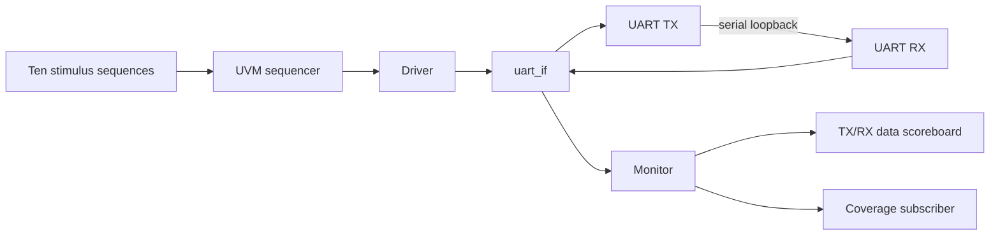

# UART Verification with SystemVerilog and UVM

A transaction-level verification environment for a configurable UART transmitter and receiver connected through an internal serial loopback. This project demonstrates constrained-random stimulus, reusable UVM components, end-to-end data checking, and functional coverage.

**Portfolio:** [Hadleeraj](https://github.com/Hadleeraj) · **Original simulation:** [EDA Playground](https://www.edaplayground.com/x/JNFA)

## Demonstrated result

A baseline run on 9 September 2026 using Synopsys VCS X-2025.06-SP1 completed **95 matching transfers**, with **0 scoreboard failures**, **0 UVM warnings**, **0 UVM errors**, and **0 UVM fatals**. The existing coverage model reported **85.58% overall coverage**. This is one simulation run, not coverage closure or independent UART compliance certification.

## Architecture



The environment connects the monitor analysis port to both the scoreboard and coverage subscriber. The test raises an objection, runs ten sequences in order, and allows a short drain interval before ending simulation.

## Verification scope

| Area | Implemented behavior |
|---|---|
| Payload width | 5, 6, 7, and 8 bits |
| Randomized baud rates | 4800, 9600, 14400, 19200, 38400, and 57600 |
| Framing | Parity enabled/disabled; parity selector; one/two stop-bit stimulus |
| Stimulus | Ten sequences, 95 total transfers; constrained random payloads and settings |
| Checking | Compare transmitted data with received parallel output |
| Coverage | Baud, length, parity enable/type, stop configuration, payload patterns, operation bins, and three crosses |
| Debug | UVM component logs and VCD waveform dump |

The two-stop-bit sequence uses eight-bit data and parity. The first sequence fixes baud to 9600 despite its random-baud name. The stimulus does not exhaust every configuration combination.

## Source map

| Files | Purpose |
|---|---|
| `design.sv` | Baud generator, TX/RX state machines, and loopback top |
| `testbench.sv`, `uart_if.sv` | DUT wiring, 50 MHz clock, virtual-interface configuration, and test entry |
| `uart_transaction.sv`, `uart_sequence.sv` | Transaction constraints and ten stimulus sequences |
| `uart_driver.sv`, `uart_monitor.sv` | Pin-level driving and completed-transfer observation |
| `uart_scoreboard.sv`, `uart_coverage.sv` | Data comparison and functional coverage |
| `uart_config.sv`, `uart_agent.sv`, `uart_env.sv`, `uart_test.sv` | UVM configuration, hierarchy, connectivity, and orchestration |

All 13 SystemVerilog files are exported from the linked playground. Keep them together: `testbench.sv` includes the supporting files. Compile only `design.sv` and `testbench.sv` as compilation roots; compiling every `.sv` separately can create duplicate definitions.

## Run

Open the linked playground and click **Run**, or use a licensed SystemVerilog simulator with UVM, constrained-random, and covergroup support. The test entry is `test`; top module is `tb`.

Example for the VCS UVM source layout used by the playground (set `UVM_HOME` to your installed UVM library):

```bash
vcs -full64 -sverilog -timescale=1ns/1ns \
  +incdir+. +incdir+$UVM_HOME/src \
  $UVM_HOME/src/uvm.sv $UVM_HOME/src/dpi/uvm_dpi.cc \
  -CFLAGS -DVCS design.sv testbench.sv -o simv
./simv +ntb_random_seed=1 | tee run.log
```

The command is a local adaptation of the observed playground invocation; simulator installation paths and licenses are not bundled. Inspect `dump.vcd` with a waveform viewer. Confirm 95 scoreboard `TEST PASSED` messages, no `TEST FAILED` messages, and zero UVM errors/fatals.

## Interpreting coverage and current limitations

- The baseline reported 100% baud, length, parity-enable, and stop-bit coverpoints; payload-pattern coverage was 50%. These individual percentages do not imply full cross coverage.
- The monitor does not populate the operation field, and reset transactions are also sampled. Operation coverage and the aggregate percentage therefore need refinement before use as closure metrics.
- Scoreboard mismatches currently use `uvm_info`; the UVM error count alone cannot determine success. Search the log for `TEST FAILED` as well.
- TX and RX share the same RTL interpretation of parity. The parity-selector naming should be checked against conventional odd/even wire parity before claiming interoperability.
- Error outputs, malformed frames, independent serial stimulus, reset during traffic, and timeout recovery are not comprehensively checked.

## Next verification steps

Promote mismatches to UVM errors, add transaction counters and a watchdog, sample coverage only for completed non-reset transfers, derive operation coverage from observed settings, and introduce an independent serial reference model with framing/parity fault injection. Expand the regression across explicit seeds and corner-case configurations.

## Provenance

This repository presents my UART UVM project originally hosted on EDA Playground. The exported source is preserved; this README documents the implemented behavior, measured baseline, and review findings. No new license is asserted over source whose original licensing is unspecified.
